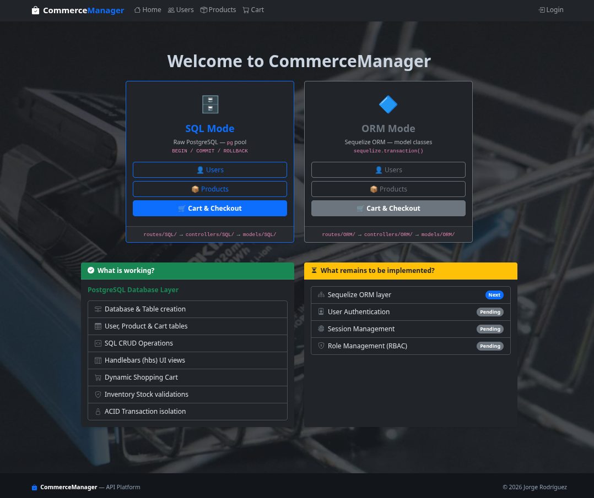
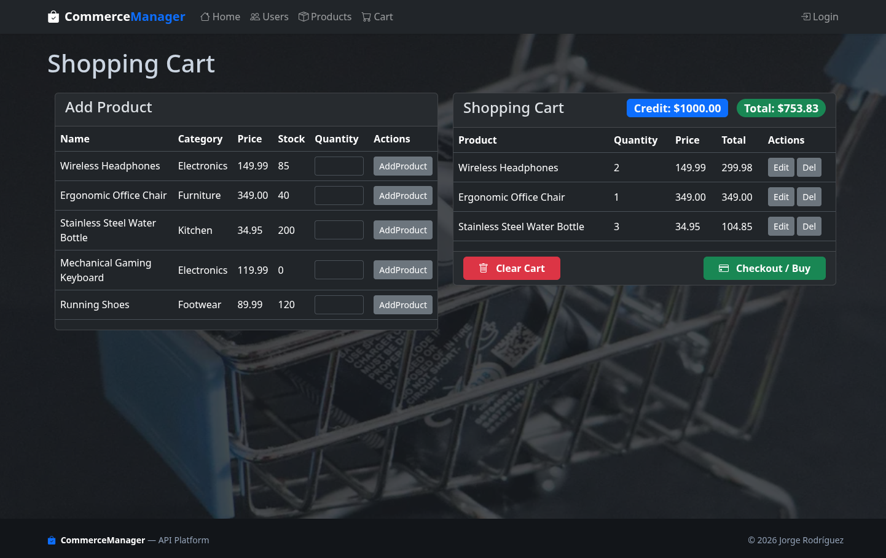

# CommerceManager

A RESTful platform covering **User Administration**, **E-Commerce**, and **Inventory Management**, built with **Node.js**, **Express**, **PostgreSQL** and **ES6** (import/export).

<p align="center">
  
  &nbsp;
  
</p>

---

## 📁 Dual Architecture Project Structure

This project acts as a dual-mode learning platform. It implements identical feature sets across two parallel backend layers: **Raw PostgreSQL (`/SQL/`)** and **Sequelize (`/ORM/`)**. Both modes are completely isolated and render the SAME Handlebars UI.

```
commerceManager/
│
├── src/
│   ├── app.js                      ← Global Express setup, middleware, and route dual-mounting
│   │
│   ├── config/
│   │   ├── SQL/                    
│   │   │   ├── db.js               ← Raw PostgreSQL connection pool
│   │   │   ├── create_db.js        ← Initialization script to create db_jre
│   │   │   ├── create_tables.js    ← Initialization script to build tables
│   │   │   └── seed_db.js          ← Initialization script to INSERT default data
│   │   │
│   │   └── ORM/                    ← (Pending) Sequelize configuration (new Sequelize())
│   │
│   ├── models/
│   │   ├── SQL/                    
│   │   │   ├── userModel.js        ← Raw `pg` queries for Users (accepts dbClient)
│   │   │   ├── productModel.js     ← Raw `pg` queries for Products (accepts dbClient)
│   │   │   └── cartModel.js        ← Raw `pg` queries for Cart & Inventory
│   │   │
│   │   └── ORM/                    ← (Pending) Sequelize class models
│   │
│   ├── controllers/
│   │   ├── SQL/                    
│   │   │   ├── appController.js    ← Home page handler
│   │   │   ├── userController.js   ← User CRUD handlers
│   │   │   ├── productController.js← Product CRUD handlers
│   │   │   └── cartController.js   ← Atomic transaction manager for Cart / Checkout
│   │   │
│   │   └── ORM/                    ← (Pending) Handlers delegating to Sequelize features
│   │
│   ├── routes/
│   │   ├── SQL/                    ← Mounted with prefix `/sql/*`
│   │   │   ├── appRoutes.js        
│   │   │   ├── userRoutes.js       
│   │   │   ├── productRoutes.js    
│   │   │   └── cartRoutes.js       
│   │   │
│   │   └── ORM/                    ← Mounted with prefix `/orm/*`
│   │
│   ├── data/
│   │   ├── users.json              ← (Deprecated) historical local data source
│   │   └── products.json           ← (Deprecated) historical local data source
│   │
│   └── views/                      ← SHARED Handlebars templates across both modes
│       ├── home.hbs                ← Home page: Select Mode (SQL vs ORM)
│       ├── products_page.hbs       ← Rendered using context variable window.API_PREFIX
│       ├── users_page.hbs          
│       ├── cart_page.hbs           
│       └── layouts/
│           └── main.hbs            ← Base layout wrapper — dynamically routes navbar links via {{prefix}}
│
├── public/                         ← Dynamic client-side scripts (adapts fetch calls via window.API_PREFIX)
│   ├── css/style.css               
│   ├── products.js                 
│   ├── users.js                    
│   └── cart.js                     
│
├── .env                            ← Environment variables
├── package.json                    
└── server.js                       ← Entry point, starts server
```

---

## 🔄 Client–Server Architecture

The application uses standard Model-View-Controller (MVC) paradigms tied to client-side Fetch API interactions. Forms do not submit HTTP natively; instead `public/*.js` scripts intercept inputs, dynamically prepend `API_PREFIX` logic (allowing side-by-side mode comparisons), and interface directly with the backend.

```
Browser (e.g. cart.js)                  Server (cartController.js → cartModel.js)
──────────────────────                  ──────────────────────────────────────────
User clicks "Checkout"     ─POST──►     checkoutCart(req, res)
fetch('/cart/checkout')                 1. BEGIN transaction (dedicated client)
                                        2. Reads cart total  (model)
                                        3. Reads user credit (model)
                                        4. Validates: credit >= total
                                        5. Deducts credit    (model)
                                        6. Clears cart       (model)
                                        7. COMMIT (or ROLLBACK on any error)
                           ◄────────    HTTP 200 "Purchase successful!"
response.ok → reload page
```

---

## 🔐 Transaction Pattern

All multi-step cart mutations (Add, Edit, Remove, Clear, Checkout) are wrapped in atomic PostgreSQL transactions. The SQL codebase pattern is:

1. **Controller** checks out a dedicated connection: `const client = await pool.connect()`
2. **Controller** opens the transaction: `await client.query('BEGIN')`
3. **Controller** calls model functions, passing `client` instead of the default `pool`
4. **Models** use `dbClient = pool` as default — so they work for single queries without any changes
5. **Controller** commits or rolls back: `COMMIT` on success, `ROLLBACK` on any thrown error
6. **Controller** always releases the connection: `client.release()` in `finally`

```js
// Model — ORM-ready, works with pool or client
const getCartItem = async (userId, productId, dbClient = pool) => { ... };

// Controller — manages transaction, delegates SQL to models
const client = await pool.connect();
try {
    await client.query('BEGIN');
    const item = await getCartItem(userId, productId, client); // passes client
    await updateProductStock(productId, newStock, client);     // passes client
    await client.query('COMMIT');
} catch (err) {
    await client.query('ROLLBACK');
} finally {
    client.release();
}
```

---

## 📌 API Endpoints

The endpoints are cleanly namespaced. The `public/` JS scripts automatically prepend the active mode suffix (`/sql` or `/orm`). 

### Users
| Method | Endpoint | Description |
|--------|----------|-------------|
| GET | `/sql/users` | Get all users (incl. credit balance) |
| POST | `/sql/user` | Create a user (with starting credit) |
| PUT | `/sql/user/:id` | Update a user (incl. credit amount) |
| DELETE | `/sql/user/:id` | Delete a user |

### Products
| Method | Endpoint | Description |
|--------|----------|-------------|
| GET | `/sql/products` | List all products |
| POST | `/sql/product` | Create a product |
| PUT | `/sql/product/:id` | Update a product |
| DELETE | `/sql/product/:id` | Delete a product |

### Cart
| Method | Endpoint | Description |
|--------|----------|-------------|
| GET | `/sql/cart` | View current user cart + credit balance |
| POST | `/sql/cart` | Add product to cart — atomic: deducts shelf stock |
| PUT | `/sql/cart/:id` | Edit item quantity — atomic: syncs shelf stock delta |
| DELETE | `/sql/cart/:id` | Remove product — atomic: restores shelf stock |
| DELETE | `/sql/cart` | Clear entire cart — atomic: restores all shelf stock |
| POST | `/sql/cart/checkout` | Purchase cart — atomic: deducts user credit, clears cart |

*(Note: Swap `/sql` for `/orm` to test the Sequelize implementations once built!)*

---

## ✅ Completed Features

- **Dual-Stack Scaffolding** — Entire project compartmentalized into matching `SQL` and `ORM` namespaces.
- **Dynamic Handlebars UI Engine** — Shared UI seamlessly shifts REST calls based on `res.locals.prefix`.
- **PostgreSQL Database Integration** — Global pool with automated initialization on boot.
- **User Management** — CRUD with per-user `credit` balance logic.
- **Product Management** — CRUD with real-time `stock` tracking.
- **Dynamic Inventory Management** — Real-time logical shelf stock allocations on every cart action with quantity upserting.
- **ACID Transaction Management** — All cart mutations wrapped in database-isolated `BEGIN/COMMIT/ROLLBACK` protection constraints.
- **Checkout System** — Deducts credit + verifies real-world funds natively preventing floating drift bugs.

## ⏳ What remains to be implemented?

- Configure Object-Relational Mapping (ORM) setup using Sequelize logic.
- User authentication & Role-based Access Control (RBAC).
- Session management (replace the hardcoded `userId = 1` logic).

---

## 🔑 Environment Variables

```env
PORT=3000

DB_HOST=localhost
DB_PORT=5432
DB_NAME=db_jre
DB_USER=postgres
DB_PASSWORD=your_password
```
